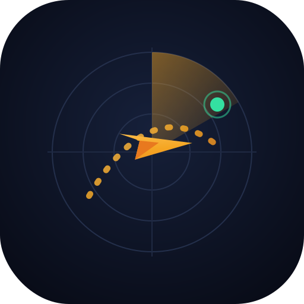

<div align="center">
  
  <h1>NachoVuela ✈️</h1>
  <p><em>Tu radar personal de oportunidades de vuelos con millas Smiles.</em></p>
</div>

---

## ¿Qué es?

Una app (que se instala en el celular y se usa también en la compu) que **rastrilla
solo** los precios de vuelos award de **Smiles Argentina** — para no tener que
buscar día por día como hasta ahora. Te muestra:

- 🟢 **Semáforo de oportunidades**: cada precio marcado como *oportunidad / buen precio /
  normal / caro*, comparado contra el histórico de la ruta y contra tu propio registro.
- 📅 **El mes entero de una**: el precio award mínimo de cada día del mes, en una vista calendario.
- 🧳 **Tus viajes**: cargás fecha, destinos posibles (EE.UU. vs Europa, etc.) y ves el mejor precio de cada uno.
- 🌡️ **Ficha por destino**: precio promedio por mes (dónde está la temporada alta) + curva de temperaturas, para decidir si conviene adelantar o atrasar.
- ↗️ **Abrir en Smiles**: un toque y te lleva a la búsqueda exacta en Smiles para sacar el pasaje.

Todo con **millas** como unidad de comparación (así comparás manzanas con manzanas
entre destinos), y **costo cero**: no usa ningún servicio pago.

---

## Cómo está armado (en criollo)

```
NachoVuela/
├── index.html · styles.css · app.js   ← la app (lo que ves)
├── assets/logo-mark.svg               ← el logo
├── engine/                            ← el "motor" que busca en Smiles
│   ├── rastrillar.py                  ← el que hace todo el trabajo
│   ├── smiles_client.py               ← habla con Smiles
│   ├── clima_client.py                ← trae temperaturas (Open-Meteo, gratis)
│   ├── destinos.py                    ← catálogo de destinos y aeropuertos
│   └── config.json                    ← ⚙️ TUS viajes y destinos vigilados
├── data/                              ← los resultados (los lee la app)
└── scripts/                          ← correr y agendar automático
```

**El motor corre en tu Mac** (con tu IP de casa, que es lo más seguro porque
Smiles bloquea las búsquedas masivas de servidores). Cada corrida guarda los
datos y los sube a GitHub; la app —alojada gratis en GitHub Pages— los muestra
en tu celular estés donde estés.

---

## Puesta en marcha

### 1. Probar el motor (ya mismo, local)

```bash
cd ~/Desktop/NachoVuela
pip3 install -r requirements.txt      # una sola vez (instala 'requests')
python3 engine/rastrillar.py --demo   # prueba rápida (una ruta)
python3 engine/rastrillar.py          # rastrillaje completo según tu config
```

### 2. Ver la app en local

```bash
cd ~/Desktop/NachoVuela
python3 -m http.server 8899
```
Abrí <http://localhost:8899> en el navegador.

### 3. Publicarla gratis (GitHub Pages)

1. Creá un repositorio en GitHub (puede llamarse `nachovuela`).
2. En la Terminal, dentro de la carpeta:
   ```bash
   cd ~/Desktop/NachoVuela
   git init && git add . && git commit -m "NachoVuela v1"
   git branch -M main
   git remote add origin https://github.com/TU_USUARIO/nachovuela.git
   git push -u origin main
   ```
3. En GitHub → **Settings → Pages** → *Source: Deploy from a branch* → rama `main`, carpeta `/ (root)` → Save.
4. En un minuto tu app queda en `https://TU_USUARIO.github.io/nachovuela/`.
5. En el celular, abrí ese link y usá **"Agregar a pantalla de inicio"** (iPhone: botón compartir → Agregar a inicio). Queda como una app más, a pantalla completa.

### 4. Dejar que busque solo

Seguí **[scripts/agendar.md](scripts/agendar.md)**: en dos comandos queda
agendado para rastrillar a las 9:00 y 20:00 y publicar los datos solo.

---

## Configurar tus viajes

Editá **`engine/config.json`**. Ejemplo:

```json
{
  "viajes": [
    {
      "nombre": "Viaje en familia 2027",
      "activo": true,
      "origenes": ["EZE"],
      "destinos": ["miami", "madrid", "roma"],
      "meses": ["2027-02", "2027-03"]
    }
  ],
  "destinos_vigilados": ["miami", "rio", "bariloche"],
  "meses_vigilados": ["2026-11", "2027-03"]
}
```

- **destinos**: usá las claves de `engine/destinos.py` (`miami`, `madrid`, `roma`,
  `barcelona`, `nueva_york`, `rio`, `bariloche`, etc.). Cada uno ya trae sus
  aeropuertos alternativos (Miami rastrea también Fort Lauderdale y Orlando).
- **meses**: formato `AAAA-MM`.
- ¿Falta un destino? Agregalo en `engine/destinos.py` copiando un bloque
  existente (necesita el código IATA y las coordenadas lat/lon para el clima).

---

## Preguntas frecuentes

**¿Por qué algunos meses dicen "sin disponibilidad"?**
Porque Smiles todavía no liberó asientos award para esas fechas (no es un error).
Se van abriendo con el tiempo — por eso conviene el rastrillaje diario.

**¿Y las escalas / vuelo directo?**
El calendario de Smiles da el precio mínimo del día pero no el detalle de escalas.
Ese filtro queda para una v2 (hay que "abrir" cada día en la web de Smiles). Por ahora,
el botón *Abrir en Smiles* te lleva a la búsqueda exacta para ver las escalas ahí.

**Si un día deja de traer precios, ¿qué pasó?**
Puede que Smiles haya rotado su clave interna. En `engine/smiles_client.py` hay
dos valores (`API_KEY` y `BEARER`) que se pueden actualizar mirando una búsqueda
real en smiles.com.ar (pestaña Red del navegador). Es raro que pase.

---

<div align="center"><sub>Hecho para cazar millas. Buen viaje 🌎</sub></div>
